# 🤝 Why Both Supabase AND Redis?

## The Quick Answer

**Supabase** = Your main database (stores users, sends emails, manages sessions)  
**Redis** = Your rate limiter (counts login attempts, prevents abuse)

They work together but do completely different jobs!

---

## What Each Service Does

### 🟢 Supabase (Your Authentication & Database)
**Purpose**: Permanent data storage and authentication

- ✅ Stores **user accounts** and profiles
- ✅ Sends **magic link emails**
- ✅ Manages **authentication sessions**
- ✅ Stores all your **app data** (documents, providers, contacts)
- ✅ Provides **real-time updates**
- ✅ Handles **user permissions**

**Think of it as**: Your app's brain and memory

### 🔴 Upstash Redis (Your Rate Limiter)
**Purpose**: Temporary counters that auto-expire

- ✅ Counts **login attempts per IP**
- ✅ Blocks IPs after **5 failed attempts**
- ✅ **Auto-forgets** attempts after 1 hour
- ✅ Protects against **brute force attacks**
- ❌ Doesn't store any user data
- ❌ Doesn't know about your users

**Think of it as**: A bouncer with a tally counter

---

## How They Work Together

```mermaid
graph LR
    A[User Login Attempt] --> B{Redis: Check Rate Limit}
    B -->|Too Many Attempts| C[❌ Block Request]
    B -->|Under Limit| D[✅ Continue to Supabase]
    D --> E[Supabase: Validate User]
    E --> F[Send Magic Link Email]
    F --> G[Create Session]
```



### Step-by-Step Flow

1. **User tries to login** → First stop: Redis
2. **Redis checks**: "Has this IP tried too many times?"
   - If YES → Block immediately (don't even check Supabase)
   - If NO → Continue to Supabase
3. **Supabase checks**: "Is this a valid user?"
   - Sends magic link
   - Creates session
   - Manages authentication

---

## Visual Comparison

### 📊 Data Storage Comparison

| **Upstash Redis** | **Supabase** |
|-------------------|--------------|
| 🕐 **Temporary Data** | 💾 **Permanent Data** |
| Login attempt: 1 | user@med.cornell.edu |
| Login attempt: 2 | Created: 2024-01-15 |
| Login attempt: 3 | Role: admin |
| Expires in: 47 min | Sessions, documents, etc. |
| **Auto-deletes after 1 hour** | **Keeps forever** |

### 🏗️ Architecture Overview

```text
┌─────────────────────────────────────────────────────────┐
│                    Your Application                      │
├─────────────────────┬───────────────────────────────────┤
│    Rate Limiting    │         Everything Else           │
│   (Upstash Redis)   │          (Supabase)              │
├─────────────────────┼───────────────────────────────────┤
│ • Count attempts    │ • User authentication             │
│ • Block abusers     │ • Email sending                   │
│ • Auto-expire data  │ • Session management              │
│ • Fast counters     │ • Data storage                    │
│                     │ • Real-time subscriptions         │
│                     │ • Row-level security              │
└─────────────────────┴───────────────────────────────────┘
```

---

## Why Not Use Supabase for Rate Limiting?

You *could* use Supabase for rate limiting, but here's why Redis is better:

### ❌ Problems with Supabase for Rate Limiting

1. **No auto-expiration** - You'd need a cron job to clean old attempts
2. **Slower for counting** - Database queries vs in-memory operations
3. **Wastes resources** - Using permanent storage for temporary data
4. **More complex** - Need to write cleanup functions

### ✅ Why Redis is Perfect

1. **Built for this** - Redis excels at temporary counters
2. **Lightning fast** - Microsecond response times
3. **Auto-cleanup** - Data expires automatically
4. **Simple API** - Just increment and check

---

## Real-World Analogy 🏪

Think of it like a retail store:

- **Supabase** = Your inventory system, customer database, and cash register
- **Redis** = The security guard counting how many times someone tries the door

The security guard (Redis) doesn't need to know about your inventory or customers. They just need to count and remember "this person tried 5 times in the last hour."

---

## Code Example: How They Work Together

```typescript
// 1. First, check Redis rate limit
const rateLimitResult = await checkRateLimit(ipAddress)

if (!rateLimitResult.allowed) {
  // Redis says: "Too many attempts!"
  return { error: "Too many login attempts. Try again later." }
}

// 2. Redis says OK, now check with Supabase
const { error } = await supabase.auth.signInWithOtp({
  email: userEmail,
  options: {
    emailRedirectTo: redirectUrl
  }
})

// 3. Supabase handles the actual authentication
```

---

## Is Redis Required?

**No! Redis is optional.** Your app has a smart fallback:

```typescript
// From rate-limiter.ts
if (!process.env.UPSTASH_REDIS_URL) {
  console.warn('Rate limiting not configured. Skipping.')
  return { allowed: true }  // Allow all requests
}
```

### Without Redis
- ✅ App works perfectly
- ✅ Users can log in
- ❌ No protection from brute force attacks
- ❌ Someone could try 1000s of passwords

### With Redis
- ✅ All features work
- ✅ Protected from attacks
- ✅ Email service won't get overwhelmed
- ✅ Better security

---

## Cost Comparison 💰

### Supabase
- **Free tier**: 500MB database, 50,000 emails/month
- **Paid**: Starts at $25/month
- **You need this**: Core functionality

### Upstash Redis
- **Free tier**: 10,000 requests/day
- **Paid**: $0.20 per 100,000 requests
- **Optional**: Just for rate limiting

**Most apps never exceed Redis free tier!** (10,000 requests = ~3,000 login attempts)

---

## Summary: Division of Labor

| Feature | Supabase | Redis |
|---------|----------|--------|
| Store users | ✅ | ❌ |
| Send emails | ✅ | ❌ |
| Manage sessions | ✅ | ❌ |
| Store app data | ✅ | ❌ |
| Count login attempts | ❌ | ✅ |
| Auto-expire counters | ❌ | ✅ |
| Block brute force | ❌ | ✅ |

**They complement each other perfectly!**

---

## FAQ

### Q Can I use just Supabase?
**A:** Yes! The app works without Redis. You just lose rate limiting protection.

### Q Can I use a different Redis provider?
**A:** Yes! Any Redis-compatible service works (AWS ElastiCache, Redis Cloud, self-hosted).

### Q Why Upstash specifically?
**A:** It's serverless (like Netlify), has a generous free tier, and requires zero maintenance.

### Q What happens if Redis goes down?
**A:** The app continues working normally, just without rate limiting.

### Q Do they share any data?
**A:** No! Redis only knows IP addresses and attempt counts. Supabase handles all user data.

---

## The Bottom Line

- **Supabase** = Your database and auth system (required)
- **Redis** = Your rate limiter (optional but recommended)
- **Together** = A secure, scalable authentication system

Think of them as specialists:
- You wouldn't use a hammer to cut wood 🔨
- You wouldn't use a saw to drive nails 🪚

Each tool does what it does best! 🎯