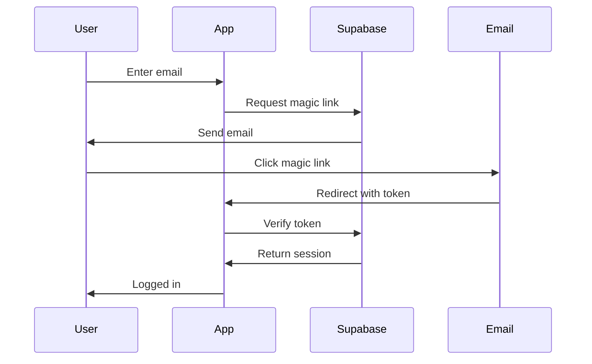

# Authentication Documentation

## Overview

The WCI@NYP application uses Supabase Auth for authentication with custom enhancements for session management, rate limiting, and admin access control.

## Architecture

### Components

1. **Auth Context** (`/src/contexts/auth-context.tsx`)
   - Manages authentication state
   - Provides auth methods to components
   - Handles session persistence

2. **Session Manager** (`/src/lib/session-manager.ts`)
   - Tracks user sessions across devices
   - Manages session metadata (device info, location)
   - Handles session revocation

3. **Auth Validation** (`/src/lib/auth-validation.ts`)
   - Validates email domains
   - Checks admin status
   - Manages access control

4. **Auth Session** (`/src/lib/auth-session.ts`)
   - Creates secure session tokens
   - Manages session expiration
   - Handles "Remember Me" functionality

## Authentication Flow

### 1. Magic Link Authentication



### 2. Session Management

After successful authentication:
1. Session token stored in secure cookie
2. Session metadata saved to database
3. Device information captured
4. Refresh token managed automatically

## Features

### Email Domain Validation

Only emails from approved domains can register:
- `@med.cornell.edu`
- `@weill.cornell.edu`
- `@nyp.org`
- `@med.cornell.edu`

```typescript
const ALLOWED_DOMAINS = [
  'med.cornell.edu',
  'weill.cornell.edu',
  'nyp.org',
  'med.cornell.edu'
]
```

### Admin Access Control

Admin status is determined by:
1. Email domain check
2. Database role lookup
3. Configuration table

```typescript
// Check admin status
const isAdmin = await checkIsAdmin(user.email, user.id)
```

### Rate Limiting

Authentication attempts are rate-limited:
- **Login**: 5 attempts per hour
- **Magic Link**: 3 requests per hour
- **Session Refresh**: 10 per hour

### Session Features

1. **Multi-Device Support**
   - View all active sessions
   - Revoke individual sessions
   - Device type detection

2. **Remember Me**
   - Normal session: 7 days
   - Remember Me: 30 days
   - Configurable via environment variables

3. **Session Metadata**
   - Browser information
   - Operating system
   - IP address (for geolocation)
   - Last activity timestamp

## Implementation Examples

### Login Component

```tsx
import { useAuth } from '@/contexts/auth-context'

function LoginPage() {
  const { signIn, loading, error } = useAuth()
  const [email, setEmail] = useState('')
  const [rememberMe, setRememberMe] = useState(false)

  const handleSubmit = async (e: FormEvent) => {
    e.preventDefault()
    await signIn(email, rememberMe)
  }

  return (
    <form onSubmit={handleSubmit}>
      <Input
        type="email"
        value={email}
        onChange={(e) => setEmail(e.target.value)}
        placeholder="Enter your email"
      />
      <Checkbox
        checked={rememberMe}
        onCheckedChange={setRememberMe}
      >
        Remember me for 30 days
      </Checkbox>
      <Button type="submit" disabled={loading}>
        {loading ? 'Sending...' : 'Send Magic Link'}
      </Button>
      {error && <Alert>{error}</Alert>}
    </form>
  )
}
```

### Protected Route

```tsx
import { useAuth } from '@/contexts/auth-context'
import { useRouter } from 'next/navigation'

function ProtectedPage() {
  const { user, loading } = useAuth()
  const router = useRouter()

  useEffect(() => {
    if (!loading && !user) {
      router.push('/login')
    }
  }, [user, loading, router])

  if (loading) return <LoadingSpinner />
  if (!user) return null

  return <div>Protected content</div>
}
```

### Admin Route

```tsx
function AdminPage() {
  const { user } = useAuth()
  const [isAdmin, setIsAdmin] = useState(false)

  useEffect(() => {
    async function checkAdmin() {
      if (user) {
        const adminStatus = await checkIsAdmin(user.email, user.id)
        setIsAdmin(adminStatus)
      }
    }
    checkAdmin()
  }, [user])

  if (!isAdmin) {
    return <div>Access denied</div>
  }

  return <div>Admin content</div>
}
```

## Security Best Practices

### 1. Token Storage
- Access tokens: In-memory only
- Refresh tokens: Secure httpOnly cookies
- No tokens in localStorage

### 2. Session Security
- CSRF protection via SameSite cookies
- Secure flag on production
- HttpOnly to prevent XSS

### 3. Rate Limiting
- Implemented at API level
- Per-user and per-IP limits
- Exponential backoff for failures

### 4. Input Validation
- Email format validation
- Domain whitelist enforcement
- Sanitization of all inputs

## Configuration

### Environment Variables

```bash
# Supabase
NEXT_PUBLIC_SUPABASE_URL=your-project-url
NEXT_PUBLIC_SUPABASE_ANON_KEY=your-anon-key

# Session Configuration
SESSION_DURATION_DAYS=7
SESSION_DURATION_REMEMBER_ME_DAYS=30
MAGIC_LINK_EXPIRY_MINUTES=10

# Rate Limiting
RATE_LIMIT_ENABLED=true
RATE_LIMIT_MAX_ATTEMPTS=5
RATE_LIMIT_WINDOW=3600

# Security
SECURE_COOKIES=true  # Set to true in production
SAME_SITE_COOKIES=lax
```

### Supabase Setup

1. **Enable Email Auth**
   ```sql
   -- In Supabase dashboard
   Authentication > Providers > Email
   ```

2. **Create Sessions Table**
   ```sql
   CREATE TABLE user_sessions (
     id UUID PRIMARY KEY DEFAULT uuid_generate_v4(),
     user_id UUID REFERENCES auth.users(id) ON DELETE CASCADE,
     token_hash VARCHAR(255) UNIQUE NOT NULL,
     device_type VARCHAR(50),
     device_name VARCHAR(255),
     browser_name VARCHAR(100),
     browser_version VARCHAR(50),
     os_name VARCHAR(100),
     os_version VARCHAR(50),
     ip_address INET,
     created_at TIMESTAMPTZ DEFAULT NOW(),
     last_activity TIMESTAMPTZ DEFAULT NOW(),
     expires_at TIMESTAMPTZ NOT NULL,
     is_active BOOLEAN DEFAULT true
   );
   ```

3. **Create Admin Config**
   ```sql
   CREATE TABLE admin_config (
     id UUID PRIMARY KEY DEFAULT uuid_generate_v4(),
     email VARCHAR(255) UNIQUE NOT NULL,
     is_active BOOLEAN DEFAULT true,
     created_at TIMESTAMPTZ DEFAULT NOW()
   );
   ```

## Troubleshooting

### Common Issues

1. **"Invalid email domain"**
   - Ensure email is from approved domain
   - Check ALLOWED_DOMAINS configuration

2. **"Rate limit exceeded"**
   - Wait for rate limit window to expire
   - Check Upstash Redis connection

3. **"Session expired"**
   - Normal behavior after inactivity
   - User needs to log in again

4. **"Magic link expired"**
   - Links expire after 10 minutes
   - Request a new magic link

### Debug Mode

Enable debug logging:
```typescript
// In development
process.env.NODE_ENV === 'development' && 
  console.log('Auth state:', { user, session })
```

### Session Inspection

View current session details:
```typescript
const sessions = await sessionManager.getUserSessions(user.id)
console.log('Active sessions:', sessions)
```

## Testing

### Unit Tests

```typescript
describe('Auth Context', () => {
  it('should validate email domains', () => {
    expect(isAllowedDomain('user@med.cornell.edu')).toBe(true)
    expect(isAllowedDomain('user@gmail.com')).toBe(false)
  })

  it('should handle sign in', async () => {
    const { signIn } = renderHook(() => useAuth())
    await act(async () => {
      await signIn('test@med.cornell.edu')
    })
    expect(mockSupabase.auth.signInWithOtp).toHaveBeenCalled()
  })
})
```

### Integration Tests

```typescript
it('should protect admin routes', async () => {
  // Mock non-admin user
  mockSupabase.auth.getUser.mockResolvedValue({
    data: { user: { email: 'user@med.cornell.edu' } }
  })
  
  render(<AdminPage />)
  
  expect(screen.getByText('Access denied')).toBeInTheDocument()
})
```

## Future Enhancements

1. **Multi-Factor Authentication (MFA)**
   - TOTP support
   - SMS verification
   - Backup codes

2. **OAuth Providers**
   - Microsoft Azure AD
   - Google Workspace
   - Okta integration

3. **Advanced Session Management**
   - IP geolocation
   - Suspicious activity detection
   - Session activity logs

4. **Password Authentication**
   - As fallback option
   - Password policies
   - Password reset flow