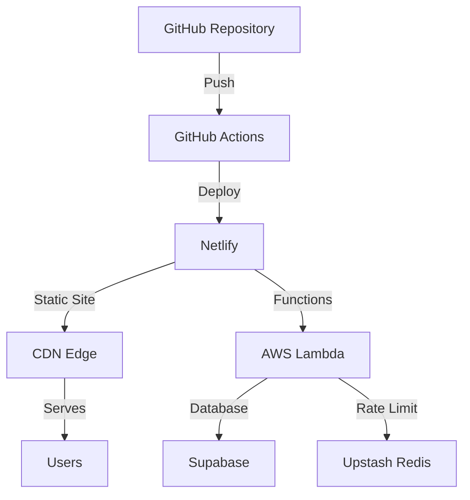

# Deployment Guide

## Overview

The WCI@NYP application is deployed on Netlify with serverless functions, Supabase for the database, and Upstash Redis for rate limiting. This guide covers deployment configuration, environment setup, and best practices.

## Deployment Architecture



## Prerequisites

1. **Netlify Account** with a team/project
2. **Supabase Project** with database configured
3. **Upstash Redis** instance for rate limiting
4. **GitHub Repository** with deployment permissions

## Environment Configuration

### 1. Local Development (.env.local)

```bash
# Supabase
NEXT_PUBLIC_SUPABASE_URL=https://your-project.supabase.co
NEXT_PUBLIC_SUPABASE_ANON_KEY=your-anon-key
SUPABASE_SERVICE_ROLE_KEY=your-service-role-key

# Upstash Redis
UPSTASH_REDIS_REST_URL=https://your-redis.upstash.io
UPSTASH_REDIS_REST_TOKEN=your-redis-token

# App Configuration
NEXT_PUBLIC_APP_URL=http://localhost:3000
NODE_ENV=development

# Feature Flags
ENABLE_RATE_LIMITING=true
ENABLE_ERROR_REPORTING=false
```

### 2. Production Environment (Netlify)

Set these in Netlify Dashboard > Site Settings > Environment Variables:

```bash
# Critical - Must be set
NEXT_PUBLIC_SUPABASE_URL
NEXT_PUBLIC_SUPABASE_ANON_KEY
SUPABASE_SERVICE_ROLE_KEY
UPSTASH_REDIS_REST_URL
UPSTASH_REDIS_REST_TOKEN

# Production URLs
NEXT_PUBLIC_APP_URL=https://wcinyp.netlify.app
NODE_ENV=production

# Security
ALLOWED_EMAIL_DOMAINS=med.cornell.edu,weill.cornell.edu,nyp.org
SESSION_SECRET=generate-secure-random-string

# Optional Services
SENTRY_DSN=your-sentry-dsn
ANALYTICS_ID=your-analytics-id
```

## Netlify Configuration

### netlify.toml

```toml
[build]
  command = "npm run build"
  functions = "netlify/functions"
  publish = ".next"

[build.environment]
  NEXT_PRIVATE_TARGET = "server"

[[plugins]]
  package = "@netlify/plugin-nextjs"

[[redirects]]
  from = "/api/*"
  to = "/.netlify/functions/:splat"
  status = 200

[[headers]]
  for = "/*"
  [headers.values]
    X-Frame-Options = "DENY"
    X-Content-Type-Options = "nosniff"
    X-XSS-Protection = "1; mode=block"
    Referrer-Policy = "strict-origin-when-cross-origin"
    Permissions-Policy = "camera=(), microphone=(), geolocation=()"

[[headers]]
  for = "/*.js"
  [headers.values]
    Cache-Control = "public, max-age=31536000, immutable"

[[headers]]
  for = "/*.css"
  [headers.values]
    Cache-Control = "public, max-age=31536000, immutable"

[[headers]]
  for = "/images/*"
  [headers.values]
    Cache-Control = "public, max-age=31536000, immutable"

[functions]
  node_bundler = "esbuild"
  
[[edge_functions]]
  path = "/api/*"
  function = "api-handler"
```

## Deployment Steps

### 1. Initial Setup

```bash
# Install Netlify CLI
npm install -g netlify-cli

# Login to Netlify
netlify login

# Link to site
netlify link

# Create new site (if needed)
netlify sites:create --name wcinyp
```

### 2. Environment Variables

```bash
# Set production environment variables
netlify env:set NEXT_PUBLIC_SUPABASE_URL "your-value"
netlify env:set NEXT_PUBLIC_SUPABASE_ANON_KEY "your-value"
# ... set all required variables

# Import from .env file
netlify env:import .env.production
```

### 3. Deploy

```bash
# Deploy to production
netlify deploy --prod

# Deploy preview
netlify deploy

# Deploy specific branch
netlify deploy --branch feature/new-feature
```

## GitHub Actions CI/CD

### .github/workflows/deploy.yml

```yaml
name: Deploy to Production

on:
  push:
    branches: [main]

jobs:
  deploy:
    runs-on: ubuntu-latest
    
    steps:
      - uses: actions/checkout@v3
      
      - name: Setup Node.js
        uses: actions/setup-node@v3
        with:
          node-version: '18'
          cache: 'npm'
      
      - name: Install dependencies
        run: npm ci
      
      - name: Run tests
        run: npm run test:ci
      
      - name: Type check
        run: npm run type-check
      
      - name: Build application
        run: npm run build
        env:
          NEXT_PUBLIC_SUPABASE_URL: ${{ secrets.NEXT_PUBLIC_SUPABASE_URL }}
          NEXT_PUBLIC_SUPABASE_ANON_KEY: ${{ secrets.NEXT_PUBLIC_SUPABASE_ANON_KEY }}
      
      - name: Deploy to Netlify
        uses: nwtgck/actions-netlify@v2
        with:
          publish-dir: '.next'
          production-branch: main
          github-token: ${{ secrets.GITHUB_TOKEN }}
          deploy-message: "Deploy from GitHub Actions"
        env:
          NETLIFY_AUTH_TOKEN: ${{ secrets.NETLIFY_AUTH_TOKEN }}
          NETLIFY_SITE_ID: ${{ secrets.NETLIFY_SITE_ID }}
```

## Database Migrations

### Supabase Migrations

1. **Create Migration**
```bash
supabase migration new add_user_sessions
```

2. **Write Migration**
```sql
-- supabase/migrations/20240101000000_add_user_sessions.sql
CREATE TABLE IF NOT EXISTS user_sessions (
  id UUID PRIMARY KEY DEFAULT uuid_generate_v4(),
  user_id UUID REFERENCES auth.users(id) ON DELETE CASCADE,
  -- ... rest of schema
);
```

3. **Apply Migration**
```bash
# Local
supabase db push

# Production
supabase db push --db-url $PRODUCTION_DB_URL
```

## Monitoring and Logs

### 1. Netlify Functions Logs

```bash
# View function logs
netlify functions:log

# Stream logs
netlify functions:log --tail

# Filter by function
netlify functions:log submit-form
```

### 2. Application Monitoring

```javascript
// lib/monitoring.ts
export function trackEvent(name: string, properties?: Record<string, any>) {
  if (process.env.NODE_ENV === 'production') {
    // Send to analytics service
    analytics.track(name, properties)
  }
}

export function reportError(error: Error, context?: Record<string, any>) {
  if (process.env.NODE_ENV === 'production') {
    // Send to error tracking service
    Sentry.captureException(error, { extra: context })
  }
}
```

### 3. Performance Monitoring

```javascript
// Track Web Vitals
export function reportWebVitals(metric: NextWebVitalsMetric) {
  if (process.env.NODE_ENV === 'production') {
    // Send to analytics
    analytics.track('Web Vitals', {
      name: metric.name,
      value: metric.value,
      label: metric.id
    })
  }
}
```

## Security Checklist

- [ ] All environment variables set in Netlify
- [ ] Service role keys not exposed to client
- [ ] CORS properly configured
- [ ] Rate limiting enabled
- [ ] Security headers configured
- [ ] HTTPS enforced
- [ ] Domain validation active
- [ ] Admin routes protected
- [ ] Input sanitization enabled
- [ ] Error messages don't leak sensitive info

## Performance Optimization

### 1. Build Optimization

```javascript
// next.config.js
module.exports = {
  images: {
    domains: ['wcinyp.org'],
    formats: ['image/avif', 'image/webp']
  },
  compress: true,
  poweredByHeader: false,
  reactStrictMode: true,
  swcMinify: true
}
```

### 2. Function Optimization

```typescript
// Reuse connections
let supabaseClient: SupabaseClient | null = null

export function getSupabase() {
  if (!supabaseClient) {
    supabaseClient = createClient(...)
  }
  return supabaseClient
}
```

### 3. Caching Strategy

```typescript
// Cache control headers
export const config = {
  api: {
    bodyParser: {
      sizeLimit: '1mb',
    },
  },
}

// Response caching
return new Response(JSON.stringify(data), {
  headers: {
    'Content-Type': 'application/json',
    'Cache-Control': 's-maxage=60, stale-while-revalidate'
  }
})
```

## Rollback Procedures

### 1. Quick Rollback

```bash
# List recent deploys
netlify deploy --list

# Rollback to specific deploy
netlify deploy --restore <deploy-id>
```

### 2. Database Rollback

```bash
# Revert last migration
supabase db reset --db-url $PRODUCTION_DB_URL

# Apply specific migration
supabase db push --db-url $PRODUCTION_DB_URL --up-to 20240101000000
```

## Troubleshooting

### Common Issues

1. **Build Failures**
   - Check Node version matches (18.x)
   - Clear cache: `netlify build --clear-cache`
   - Verify environment variables

2. **Function Timeouts**
   - Default timeout: 10 seconds
   - Increase in netlify.toml if needed
   - Optimize database queries

3. **CORS Errors**
   - Check function response headers
   - Verify allowed origins
   - Handle preflight requests

4. **Rate Limiting Issues**
   - Check Redis connection
   - Verify rate limit configuration
   - Monitor Redis memory usage

### Debug Mode

Enable debug logging in production (temporarily):

```bash
netlify env:set DEBUG true
netlify deploy --prod
```

## Maintenance Mode

### 1. Enable Maintenance

```javascript
// middleware.ts
export function middleware(request: NextRequest) {
  if (process.env.MAINTENANCE_MODE === 'true') {
    return NextResponse.rewrite(new URL('/maintenance', request.url))
  }
}
```

### 2. Maintenance Page

```tsx
// app/maintenance/page.tsx
export default function MaintenancePage() {
  return (
    <div className="flex min-h-screen items-center justify-center">
      <div className="text-center">
        <h1>Under Maintenance</h1>
        <p>We'll be back shortly.</p>
      </div>
    </div>
  )
}
```

## Backup Procedures

### 1. Database Backups

```bash
# Manual backup
supabase db dump --db-url $PRODUCTION_DB_URL > backup-$(date +%Y%m%d).sql

# Restore backup
psql $PRODUCTION_DB_URL < backup-20240101.sql
```

### 2. Automated Backups

Configure in Supabase Dashboard:
- Daily automated backups
- Point-in-time recovery (7 days)
- Cross-region replication

## Cost Optimization

### 1. Netlify Usage

- Monitor build minutes
- Use build cache effectively
- Optimize function execution time
- Enable bandwidth alerts

### 2. Supabase Limits

- Monitor database size
- Optimize queries
- Use connection pooling
- Archive old data

### 3. Redis Usage

- Set appropriate TTLs
- Monitor memory usage
- Use efficient data structures
- Regular key cleanup

## Post-Deployment Checklist

- [ ] Verify all pages load correctly
- [ ] Test authentication flow
- [ ] Check function endpoints
- [ ] Verify rate limiting works
- [ ] Test form submissions
- [ ] Check error handling
- [ ] Monitor performance metrics
- [ ] Verify security headers
- [ ] Test on multiple devices
- [ ] Check accessibility