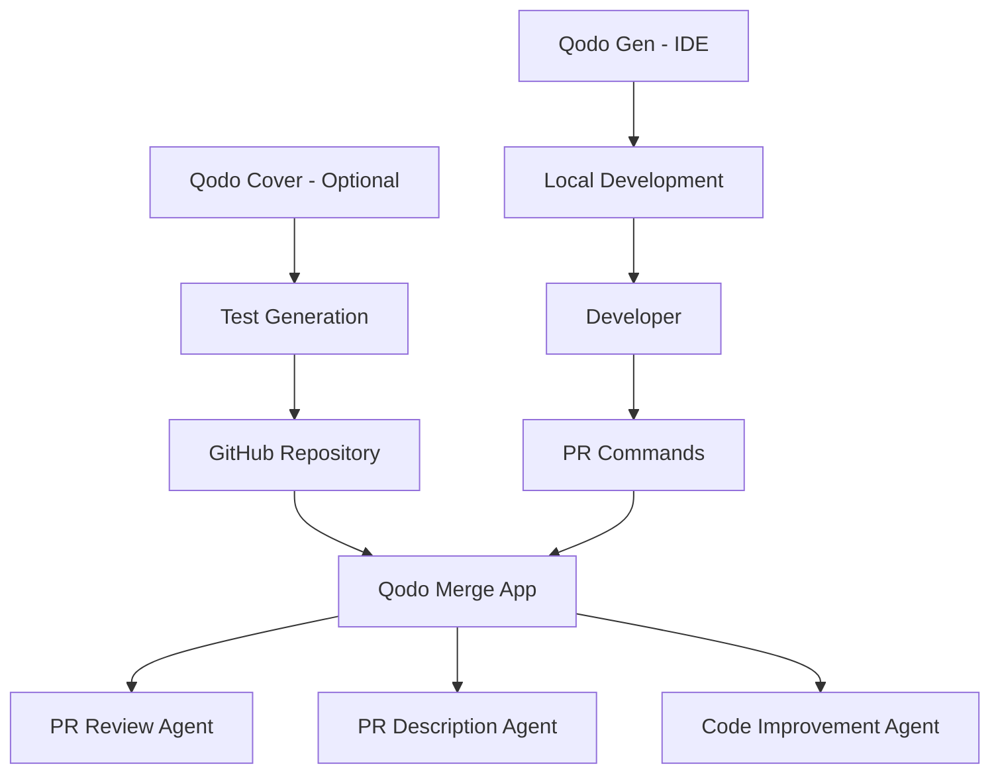

# Qodo Integration Plan for WCI@NYP

## Executive Summary

This document outlines a comprehensive plan for integrating Qodo Merge (formerly PR-Agent) into the WCI@NYP codebase. Qodo Merge is an AI-powered code review tool that provides automated PR analysis, feedback, and suggestions. The integration leverages the GitHub App model, requiring no API keys or infrastructure maintenance.

## Table of Contents

1. [Current State Analysis](#current-state-analysis)
2. [Qodo vs CodeRabbit Comparison](#qodo-vs-coderabbit-comparison)
3. [Integration Architecture](#integration-architecture)
4. [Configuration Strategy](#configuration-strategy)
5. [Implementation Steps](#implementation-steps)
6. [Team Guidelines](#team-guidelines)
7. [Migration Checklist](#migration-checklist)
8. [Cost & Usage Optimization](#cost--usage-optimization)
9. [Security Considerations](#security-considerations)
10. [Rollback Plan](#rollback-plan)

## Current State Analysis

### Existing CI/CD Infrastructure

```
.github/workflows/
├── ci.yml                    # Main CI pipeline
├── coderabbit.yml           # CodeRabbit integration (active)
├── coderabbit 2.yml         # Duplicate - to be removed
├── deploy.yml               # Deployment workflow
├── performance.yml          # Performance testing
├── performance 2.yml        # Duplicate - to be removed
├── pr-checks.yml            # PR validation
├── pr-checks 2.yml          # Duplicate - to be removed
├── scheduled-tests.yml      # Scheduled test runs
├── scheduled-tests 2.yml    # Duplicate - to be removed
├── test.yml                 # Test workflow
└── test 2.yml               # Duplicate - to be removed
```

### Key Findings
- 5 duplicate workflow files need cleanup
- CodeRabbit is currently active for PR reviews
- Strong existing CI/CD foundation with tests, performance checks, and deployment automation
- No Qodo configuration files present yet

## Qodo vs CodeRabbit Comparison

| Feature | CodeRabbit | Qodo Merge | Winner |
|---------|------------|------------|---------|
| **AI Models** | GPT-4 | GPT-4o, Claude 3.5 Sonnet | Qodo ✓ |
| **Free Tier** | Limited | 75 PRs/month | Qodo ✓ |
| **Setup Complexity** | GitHub Action | GitHub App (simpler) | Qodo ✓ |
| **API Keys Required** | Yes | No | Qodo ✓ |
| **Interactive PR Chat** | Limited | Full support | Qodo ✓ |
| **Custom Instructions** | Yes | Yes | Tie |
| **Test Generation** | No | Yes (via Qodo Cover) | Qodo ✓ |
| **Focus Modes** | No | Yes (critical issues only) | Qodo ✓ |
| **Data Privacy** | Good | Zero retention policy | Qodo ✓ |
| **Open Source Option** | No | Yes (PR-Agent) | Qodo ✓ |

### Recommendation
Qodo Merge offers superior features, better models, simpler setup, and a more generous free tier. The migration is recommended.

## Integration Architecture

### Qodo Ecosystem Components



### Integration Points

1. **GitHub App (Primary)**
   - Installed at organization level
   - Automatic webhook handling
   - No infrastructure required

2. **Configuration File (Optional)**
   - `.pr_agent.toml` for customization
   - Repository-specific settings
   - Override default behaviors

3. **PR Comments Interface**
   - Interactive commands
   - Natural language queries
   - Contextual responses

## Configuration Strategy

### 1. Global Configuration (`.pr_agent.toml`)

```toml
[pr_description]
# Generate comprehensive PR descriptions
publish_description_as_comment = false
add_original_user_description = true
generate_ai_title = true
ai_title_prefix = "feat:"
include_generated_by_header = true
description_style = "bullet_points"
extra_instructions = """
- Focus on business impact
- Highlight breaking changes
- Mention performance implications
"""

[pr_reviewer]
# Automated code review settings
ask_and_reflect = true
remove_previous_review_comment = true
persistent_comment = true
inline_code_comments = true
require_security_review = true
enable_review_labels = true
# Custom review focus for healthcare app
extra_instructions = """
- Check for HIPAA compliance concerns
- Verify proper error handling
- Ensure accessibility standards (WCAG 2.1)
- React best practices and hooks usage
- TypeScript type safety
- Supabase security rules
"""

[pr_code_suggestions]
# Code improvement suggestions
num_code_suggestions = 5
summarize_suggestions = true
focus_on_important_suggestions = true
suggestion_impact = ["security", "performance", "best_practices"]
auto_approve_safe_changes = false

[pr_custom_prompt]
# Project-specific prompts
system_prompt = """
You are reviewing code for a healthcare web application (WCI@NYP).
Key technologies: Next.js 15, React 18, TypeScript, Supabase, TailwindCSS.
Focus areas: Security, performance, accessibility, and code maintainability.
"""

[pr_similar_issue]
# Link similar issues
skip_comments = false
max_issues = 3

[pr_help]
# Help command configuration
enable_help = true
show_command_list = true

[checks]
# Automated checks
enable_language_checks = true
enable_security_checks = true
enable_best_practices_checks = true

[github]
# GitHub-specific settings
publish_labels = true
handle_pr_actions = ["opened", "reopened", "synchronize"]
```

### 2. Command-Specific Configuration

```toml
[describe]
# PR description generation
max_description_length = 500
include_generated_by_header = true

[review]
# Code review settings
require_all_files_reviewed = true
max_review_length = 1000

[improve]
# Code improvement suggestions
num_suggestions_per_chunk = 3
rank_suggestions = true

[ask]
# Q&A functionality
max_answer_length = 500
include_code_examples = true
```

### 3. Repository Labels Configuration

```toml
[pr_labels]
# Automatic labeling
enable_pr_labels = true
labels = [
    "bug fix",
    "feature",
    "documentation",
    "refactoring",
    "tests",
    "performance",
    "security",
    "accessibility",
    "dependencies"
]
```

## Implementation Steps

### Phase 1: Preparation (Day 1)

1. **Audit Current State**
   ```bash
   # Document current PR review process
   # List team expectations
   # Review recent PR feedback quality
   ```

2. **Clean Up Duplicates**
   ```bash
   # Remove duplicate workflow files
   rm .github/workflows/*[[:space:]]2.yml
   ```

3. **Create Documentation**
   - Team guide for Qodo commands
   - Migration announcement
   - FAQ document

### Phase 2: Configuration (Day 2)

1. **Create Configuration File**
   ```bash
   # Create .pr_agent.toml with settings above
   touch .pr_agent.toml
   ```

2. **Configure Repository Settings**
   - Ensure PR permissions are correct
   - Set up protected branches
   - Configure merge requirements

3. **Test Configuration**
   - Create test PR
   - Verify Qodo responds
   - Adjust settings as needed

### Phase 3: Team Onboarding (Day 3-5)

1. **Training Session**
   - Demo Qodo features
   - Practice commands
   - Q&A session

2. **Documentation Distribution**
   - Share command cheat sheet
   - Update contribution guidelines
   - Add to onboarding docs

3. **Pilot Period**
   - Monitor usage
   - Collect feedback
   - Refine configuration

### Phase 4: Full Rollout (Week 2)

1. **Enable All Features**
   - Activate all configured behaviors
   - Remove any temporary limitations
   - Archive CodeRabbit workflow

2. **Monitor & Optimize**
   - Track PR review quality
   - Monitor usage against limits
   - Gather team feedback

## Team Guidelines

### Available Commands

#### Core Commands
| Command | Description | Usage |
|---------|-------------|-------|
| `/describe` | Generate PR description | Automatic on PR creation |
| `/review` | Perform code review | Automatic or `/review` |
| `/improve` | Get code suggestions | `/improve` or `/improve [file]` |
| `/ask [question]` | Ask about the PR | `/ask What are the performance implications?` |

#### Advanced Commands
| Command | Description | Usage |
|---------|-------------|-------|
| `/update_changelog` | Update CHANGELOG.md | `/update_changelog` |
| `/add_docs` | Generate documentation | `/add_docs` for new features |
| `/generate_labels` | Auto-label PR | Automatic or `/generate_labels` |
| `/similar_issue` | Find related issues | `/similar_issue` |

#### Configuration Commands
| Command | Description | Usage |
|---------|-------------|-------|
| `/config` | Show current config | `/config` |
| `/help` | Show available commands | `/help` |

### Best Practices

1. **PR Description**
   - Let Qodo generate initial description
   - Add context-specific details
   - Highlight breaking changes

2. **Code Review**
   - Review Qodo's feedback first
   - Use `/ask` for clarification
   - Focus on business logic over style

3. **Improvements**
   - Run `/improve` on complex files
   - Prioritize security suggestions
   - Consider performance impacts

4. **Interactive Usage**
   ```
   # Ask specific questions
   /ask Is this component accessible?
   /ask Are there any security concerns?
   /ask How can I improve test coverage?
   ```

### Usage Optimization (75 PRs/month limit)

1. **Prioritize Important PRs**
   - Feature branches
   - Bug fixes
   - Security updates

2. **Batch Small Changes**
   - Group related fixes
   - Combine documentation updates
   - Merge dependency updates

3. **Manual Trigger Option**
   - Use `/review` selectively
   - Skip automated review on drafts
   - Focus on complex changes

## Migration Checklist

### Pre-Migration
- [ ] Backup current PR templates
- [ ] Document team feedback on CodeRabbit
- [ ] Announce migration timeline
- [ ] Create Qodo documentation
- [ ] Clean up duplicate workflows

### Configuration
- [ ] Install Qodo Merge GitHub App
- [ ] Create `.pr_agent.toml`
- [ ] Configure repository settings
- [ ] Set up team permissions
- [ ] Test on sample PR

### Training
- [ ] Conduct team training
- [ ] Distribute command guide
- [ ] Create video tutorials
- [ ] Set up office hours
- [ ] Gather initial feedback

### Go-Live
- [ ] Enable all features
- [ ] Monitor first week usage
- [ ] Address team questions
- [ ] Refine configuration
- [ ] Document lessons learned

### Post-Migration
- [ ] Archive CodeRabbit workflow
- [ ] Update contribution docs
- [ ] Measure improvement metrics
- [ ] Plan advanced features
- [ ] Consider Qodo Cover for tests

## Cost & Usage Optimization

### Free Tier Management (75 PRs/month)

1. **PR Strategy**
   ```
   Week 1: 20 PRs (feature development)
   Week 2: 20 PRs (bug fixes)
   Week 3: 20 PRs (improvements)
   Week 4: 15 PRs (buffer)
   ```

2. **Exclusion Patterns**
   - Draft PRs
   - Documentation-only changes
   - Dependency updates (unless critical)
   - Style-only changes

3. **Team Guidelines**
   - Batch related changes
   - Use feature branches effectively
   - Coordinate PR timing
   - Monitor usage dashboard

### When to Upgrade

Consider paid tier if:
- Consistently hitting 75 PR limit
- Need advanced features
- Want priority support
- Require higher API limits

## Security Considerations

### Data Privacy
- Zero data retention policy
- No model training on code
- Encrypted transmissions
- SOC 2 compliance

### Access Control
- Organization-level installation
- Repository-specific permissions
- No access to private data
- Audit trail available

### Best Practices
1. Review Qodo's permissions regularly
2. Limit repository access appropriately
3. Monitor automated actions
4. Keep configuration in version control

## Rollback Plan

If issues arise:

### Immediate Rollback (< 5 minutes)
1. Disable Qodo Merge app in GitHub settings
2. Re-enable CodeRabbit workflow
3. Notify team via Slack

### Graceful Migration Back
1. Export useful PR reviews
2. Document what worked well
3. Gradual transition period
4. Keep configuration for future

### Rollback Triggers
- Security concerns
- Consistent poor quality reviews
- Team rejection
- Technical issues
- Cost concerns

## Success Metrics

### Week 1
- 100% of PRs receive automated review
- < 5 minutes average response time
- 80% team satisfaction

### Month 1
- 20% reduction in review cycle time
- 15% increase in caught issues
- 90% team adoption

### Quarter 1
- Measurable code quality improvement
- Reduced production incidents
- Full team proficiency

## Appendix

### A. Sample PR with Qodo Review

```markdown
## PR Description (Generated by Qodo)

### Summary
This PR implements user session management with geolocation tracking for enhanced security monitoring.

### Changes
- ✨ Added IP geolocation service using ip-api.com
- 🔒 Enhanced session tracking with location data
- 📊 Updated admin dashboard to display location info
- 🗄️ Created database migration for location fields

### Security Considerations
- Rate limiting implemented for geolocation API
- Caching to prevent API abuse
- Private IP addresses excluded

---

## Code Review (by Qodo)

### ✅ Strengths
1. Proper error handling in geolocation service
2. Efficient caching mechanism
3. TypeScript types well-defined

### 🔍 Suggestions
1. Consider adding retry logic for failed API calls
2. Add unit tests for geolocation service
3. Document rate limit considerations

### 🚨 Security Note
Ensure API endpoint is not exposed to client-side code.
```

### B. Common Scenarios

1. **Large PR Handling**
   ```
   /review --focus security
   /improve src/lib/critical-service.ts
   /ask What are the main risks?
   ```

2. **Feature Development**
   ```
   /describe --style detailed
   /generate_labels
   /similar_issue
   ```

3. **Bug Fixes**
   ```
   /review --thorough
   /ask Could this cause regressions?
   /update_changelog
   ```

### C. Troubleshooting

| Issue | Solution |
|-------|----------|
| Qodo not responding | Check GitHub app permissions |
| Wrong model responses | Adjust `.pr_agent.toml` prompts |
| Hit rate limit | Batch PRs or upgrade plan |
| Poor suggestions | Refine `extra_instructions` |

### D. Resources

- [Qodo Merge Documentation](https://qodo-merge-docs.qodo.ai/)
- [GitHub App Page](https://github.com/apps/qodo-merge-pro)
- [Open Source PR-Agent](https://github.com/qodo-ai/pr-agent)
- [Qodo Blog](https://www.qodo.ai/blog/)
- Internal Docs: `/docs/QODO_USAGE_GUIDE.md` (to be created)

---

*This plan is designed to ensure a smooth transition from CodeRabbit to Qodo Merge while maximizing the value of the free tier and improving overall code review quality.*